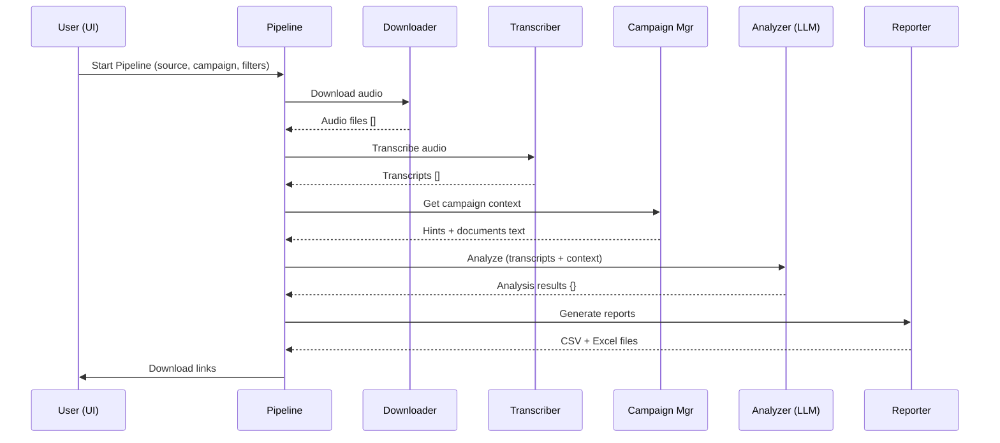

# 🏗️ Architecture Documentation

**Project:** Vicidial Call Analysis Platform
**Version:** 2.0
**Last Updated:** 2025-10-13

---

## 📐 System Overview

```
┌─────────────────────────────────────────────────────────────────┐
│                        STREAMLIT WEB UI                         │
│                         (app.py + pages/)                       │
└────────────────────────┬────────────────────────────────────────┘
                         │
        ┌────────────────┼────────────────┐
        │                │                │
        ▼                ▼                ▼
┌──────────────┐  ┌──────────────┐  ┌──────────────┐
│   Vicidial   │  │    Local     │  │ Google Drive │
│   Database   │  │    Folder    │  │     API      │
│   (MySQL)    │  │   (Audio)    │  │   (Audio)    │
└──────┬───────┘  └──────┬───────┘  └──────┬───────┘
       │                 │                 │
       └─────────────────┼─────────────────┘
                         │
                         ▼
              ┌─────────────────────┐
              │  Audio Files (.mp3) │
              └──────────┬──────────┘
                         │
                         ▼
              ┌─────────────────────┐
              │  Transcription      │
              │  (OpenAI Whisper)   │
              └──────────┬──────────┘
                         │
                         ▼
              ┌─────────────────────┐
              │  Transcript (.txt)  │
              └──────────┬──────────┘
                         │
              ┌──────────┴──────────┐
              │                     │
              ▼                     ▼
       ┌──────────────┐      ┌──────────────┐
       │   Campaign   │      │   Analysis   │
       │   Context    │─────▶│   (GPT-4)    │
       │  + Docs      │      │              │
       └──────────────┘      └──────┬───────┘
                                    │
                                    ▼
                         ┌──────────────────────┐
                         │  Reports (CSV/Excel) │
                         └──────────────────────┘
```

---

## 📂 Directory Structure

```
Analyze-calls/
├── app.py                     # Entry point - Dashboard
├── .cursorrules               # AI assistant rules
├── README.md                  # Main documentation
├── ARCHITECTURE.md            # This file
├── requirements.txt           # Python dependencies
│
├── pages/                     # UI Pages (Streamlit)
│   ├── 1_Pipeline_Komplet.py      # Main workflow orchestrator
│   ├── 2_Raporte.py                # Smart Reports UI
│   ├── 3_Rezultatet_e_Listave.py  # List analysis UI
│   ├── 4_Tools.py                  # Individual tools (tabs)
│   └── 5_Settings.py               # Settings + campaigns UI
│
├── core/                      # Business Logic (pure Python)
│   ├── analysis_llm.py            # GPT-4 analysis engine
│   ├── campaign_manager.py        # Campaign CRUD + documents
│   ├── config.py                  # Configuration loader
│   ├── constants.py               # Global constants
│   ├── db_vicidial.py             # MySQL connection
│   ├── downloader_vicidial.py     # Audio downloader
│   ├── drive_io.py                # Google Drive API
│   ├── prefix_it.py               # Italian prefix detector
│   ├── reporting_excel.py         # Excel generator
│   ├── status_settings.py         # Status cost settings
│   ├── transcription_audio.py     # Transcription orchestrator
│   ├── transcription_whisper.py   # Whisper API wrapper
│   ├── voip_rates.py              # VoIP rate manager
│   └── prompt_analysis_template.txt  # LLM prompt template
│
├── config/                    # Configuration Files
│   ├── campaign_contexts.json     # Campaign definitions
│   ├── settings.json              # App settings
│   └── voip_rates.json            # VoIP pricing
│
├── assets/                    # Static Assets
│   ├── campaigns/                 # Campaign documents
│   │   └── {campaign_id}/
│   │       ├── documents/         # Original files
│   │       └── extracted_text.txt # Extracted text
│   └── protrade.jpg               # Logo
│
├── data/                      # Reference Data
│   └── it_prefixes.csv           # Italian phone prefixes
│
├── out_analysis/              # Output Directory (generated)
│   └── {session_name}/
│       ├── Transkripte/          # Transcripts by agent
│       ├── call_analysis.csv
│       ├── agent_summary_weekly.csv
│       └── Raport_Analize.xlsx
│
└── venv/                      # Virtual environment (ignored)
```

---

## 🔄 Data Flow

### 1. User Interaction Flow

```
User → Dashboard (app.py)
       ↓
       Select: Pipeline / Tools / Reports / Settings
       ↓
       Pipeline Komplet (pages/1_Pipeline_Komplet.py)
       ↓
       [Select Source] → [Select Campaign] → [Configure] → [Run]
```

### 2. Pipeline Execution Flow



### 3. Campaign Context Flow

```
User creates campaign → Settings Page (5_Settings.py)
                        ↓
                 campaign_manager.create_campaign()
                        ↓
                 Saves to config/campaign_contexts.json
                        ↓
                 Creates folder assets/campaigns/{id}/
                        ↓
User uploads docs → campaign_manager.add_document_to_campaign()
                        ↓
                 Extracts text (PDF/DOCX/TXT)
                        ↓
                 Saves to extracted_text.txt
                        ↓
Pipeline runs → campaign_manager.get_campaign_hints()
                        ↓
                 Returns: hints + full document text
                        ↓
                 analysis_llm.analyze_agent_transcripts()
                        ↓
                 Sends to GPT-4 with campaign context
```

---

## 🧩 Module Dependencies

### Core Module Graph

```
config.py (base)
    ↓
constants.py
    ↓
campaign_manager.py ───┐
    ↓                  │
db_vicidial.py         │
    ↓                  │
downloader_vicidial.py │
    ↓                  │
transcription_audio.py │
    ↓                  │
analysis_llm.py ←──────┘
    ↓
reporting_excel.py
```

### Pages Dependencies

```
app.py
    ↓
pages/1_Pipeline_Komplet.py
    ├─→ core/downloader_vicidial.py
    ├─→ core/transcription_audio.py
    ├─→ core/campaign_manager.py
    ├─→ core/analysis_llm.py
    └─→ core/reporting_excel.py

pages/4_Tools.py
    ├─→ (Tab 1) core/db_vicidial.py
    ├─→ (Tab 2) core/drive_io.py
    └─→ (Tab 3) core/transcription_audio.py

pages/5_Settings.py
    ├─→ core/campaign_manager.py
    ├─→ core/voip_rates.py
    └─→ core/status_settings.py
```

---

## 🎨 UI Layer Architecture

### Separation of Concerns

```
┌─────────────────────────────────────────┐
│           UI LAYER (pages/)             │
│  - User input collection                │
│  - Display & formatting                 │
│  - Streamlit widgets                    │
│  - Progress bars & status               │
│  - NO business logic                    │
└──────────────┬──────────────────────────┘
               │ Calls functions
               ▼
┌─────────────────────────────────────────┐
│        LOGIC LAYER (core/)              │
│  - Data processing                      │
│  - API calls (OpenAI, Drive, DB)       │
│  - Business rules                       │
│  - Pure Python (NO Streamlit imports)  │
└──────────────┬──────────────────────────┘
               │ Reads/writes
               ▼
┌─────────────────────────────────────────┐
│       DATA LAYER (config/, assets/)     │
│  - JSON configurations                  │
│  - Document storage                     │
│  - Output files                         │
└─────────────────────────────────────────┘
```

### Key Principle: **UI NEVER contains business logic**

❌ **BAD (Logic in UI):**
```python
# pages/1_Pipeline_Komplet.py
if st.button("Analyze"):
    # Extract text from PDF
    with open(pdf_file, 'rb') as f:
        reader = PyPDF2.PdfReader(f)
        text = reader.pages[0].extract_text()

    # Call OpenAI
    response = openai.chat.completions.create(...)

    # Parse response
    data = json.loads(response.content)
```

✅ **GOOD (Logic in core):**
```python
# pages/1_Pipeline_Komplet.py
if st.button("Analyze"):
    result = analyze_campaign(campaign_id, audio_files)
    st.success(f"Done! {len(result)} calls analyzed")

# core/analysis_llm.py
def analyze_campaign(campaign_id, audio_files):
    # All the logic here
    ...
    return results
```

---

## 🔌 External Integrations

### OpenAI API

**Used for:**
- Transcription: `gpt-4o-transcribe` or `whisper-1`
- Analysis: `gpt-4.1` or configured model

**Flow:**
```python
core/transcription_audio.py
    → core/transcription_whisper.py
        → OpenAI API (audio → text)

core/analysis_llm.py
    → OpenAI API (text + prompt → structured feedback)
```

**Configuration:**
- API Key: `.streamlit/secrets.toml` or env var
- Models: Configurable in `core/constants.py`

### Vicidial MySQL Database

**Used for:**
- Fetch call recordings metadata
- Filter by date, campaign, agent
- Get call duration, status

**Flow:**
```python
pages/1_Pipeline_Komplet.py (user filters)
    → core/db_vicidial.py (query builder)
        → MySQL connection
            → Returns: [{call_id, location, agent, ...}, ...]
    → core/downloader_vicidial.py (download files)
```

**Configuration:**
- Credentials: `.streamlit/secrets.toml`
- Multiple DB support: `db` and `db2`

### Google Drive API

**Used for:**
- Download audio files from shared folders
- Upload processed files back to Drive

**Flow:**
```python
pages/1_Pipeline_Komplet.py (Drive folder ID)
    → core/drive_io.py
        → Google Drive API (OAuth2)
            → Download files
            → Create folder structure
            → Upload files
```

**Configuration:**
- OAuth2 credentials: `token.json` (auto-generated)
- Parent folder: `.streamlit/secrets.toml`

---

## 💾 Data Storage

### Configuration Files

| File | Purpose | Format |
|------|---------|--------|
| `config/campaign_contexts.json` | Campaign definitions | JSON |
| `config/settings.json` | App settings (status costs, thresholds) | JSON |
| `config/voip_rates.json` | VoIP pricing | JSON |
| `.streamlit/secrets.toml` | API keys, credentials | TOML |

### Campaign Storage

```
assets/campaigns/{campaign_id}/
├── documents/
│   ├── script.pdf           # Original file
│   ├── objections.docx      # Original file
│   └── offer.pdf            # Original file
└── extracted_text.txt       # Combined extracted text
```

**Why separate extracted_text.txt?**
- Performance: No need to re-extract on every analysis
- Caching: Text is ready for LLM
- Simplicity: Single file to read for all documents

### Output Storage

```
out_analysis/{session_name}/
├── Transkripte/
│   ├── Agent1/
│   │   ├── call001.txt
│   │   └── call002.txt
│   └── Agent2/
│       └── call003.txt
├── call_analysis.csv          # Per-call results
├── agent_summary_weekly.csv   # Per-agent summary
└── Raport_Analize.xlsx        # Formatted Excel report
```

---

## 🔐 Security Considerations

### Secrets Management

**NEVER commit:**
- `.streamlit/secrets.toml`
- `config.py` (if contains credentials)
- `*.env` files
- `token.json` (OAuth tokens)

**Store in:**
```toml
# .streamlit/secrets.toml
OPENAI_API_KEY = "sk-..."

[db]
host = "xxx.xxx.xxx.xxx"
user = "user"
password = "pass"
database = "asterisk"

[drive]
parent_id = "folder-id"
```

### Input Validation

**Always validate:**
- File sizes (max 5MB)
- File types (whitelist extensions)
- SQL parameters (parameterized queries)
- User-provided paths (prevent directory traversal)
- Campaign names (alphanumeric + spaces)

**Example:**
```python
# core/campaign_manager.py
if file_size_mb > MAX_FILE_SIZE_MB:
    raise ValueError(f"File too large: {file_size_mb:.2f}MB")

if not is_valid_extension(filename):
    raise ValueError(f"Unsupported file type: {ext}")
```

---

## 🚀 Performance Optimizations

### Caching Strategy

1. **Transcription Caching**
   - Check if `.txt` exists before transcribing
   - Option: `reuse_existing=True` (default)

2. **Streamlit Caching**
   ```python
   @st.cache_data
   def load_campaigns():
       return get_all_campaigns()
   ```

3. **Document Text Caching**
   - Extracted once → saved to `extracted_text.txt`
   - No re-extraction on subsequent analyses

### Batch Processing

- Group transcripts by agent before analysis
- Single LLM call per agent (not per call)
- Reduces API calls from N to ~10-20

### Progress Feedback

- Update progress bars every item
- Display current operation
- Show percentage completed

```python
prog = st.progress(0, text="Starting...")
for i, item in enumerate(items):
    process(item)
    percent = int((i+1)/total*100)
    prog.progress(percent, text=f"Processing: {i+1}/{total}")
```

---

## 🧪 Testing Strategy

### Manual Testing Checklist

- [ ] Dashboard loads without errors
- [ ] Pipeline with Vicidial source
- [ ] Pipeline with local folder
- [ ] Pipeline with Google Drive
- [ ] Campaign creation
- [ ] Document upload (PDF, DOCX, TXT)
- [ ] Campaign selection in pipeline
- [ ] Report generation
- [ ] Download reports

### Edge Cases

- [ ] Empty audio folder
- [ ] Invalid API key
- [ ] Database connection failure
- [ ] Large files (>5MB)
- [ ] Special characters in names
- [ ] Concurrent pipeline runs

### Automated Testing (Future)

```python
# tests/test_campaign_manager.py
def test_create_campaign():
    campaign = create_campaign(name="Test")
    assert "id" in campaign
    assert campaign["name"] == "Test"

def test_add_document_exceeds_limit():
    # Add 3 documents
    # Try to add 4th
    with pytest.raises(ValueError):
        add_document_to_campaign(...)
```

---

## 📈 Scalability Considerations

### Current Limitations

- **Single-threaded:** Streamlit runs one request at a time
- **Local storage:** Files stored on server disk
- **No database:** Config in JSON files
- **OpenAI rate limits:** ~3500 requests/min (GPT-4)

### Future Improvements

1. **Database Migration**
   - Move from JSON to PostgreSQL/MongoDB
   - Better concurrency and querying

2. **Async Processing**
   - Use Celery for background tasks
   - Queue system for pipeline jobs

3. **Cloud Storage**
   - S3/GCS for audio and documents
   - Reduce local disk usage

4. **Horizontal Scaling**
   - Multiple Streamlit instances
   - Load balancer
   - Shared database

---

## 🔧 Extension Points

### Adding a New Feature

**Example: Add "Call Sentiment" field**

1. **Update LLM prompt** (`core/prompt_analysis_template.txt`)
   ```
   Add field: "sentiment": "positive/neutral/negative"
   ```

2. **Update analysis function** (`core/analysis_llm.py`)
   ```python
   data["sentiment"] = data.get("sentiment", "neutral")
   ```

3. **Update report** (`core/reporting_excel.py`)
   ```python
   df["sentiment"] = results["sentiment"]
   ```

4. **Update UI** (optional display in UI)

### Adding a New Page

1. Create `pages/6_New_Feature.py`
2. Follow naming convention: `N_Title.py`
3. Import from `core/` for logic
4. Update dashboard links in `app.py`

### Adding a New Data Source

1. Create `core/source_name.py`
2. Implement interface:
   ```python
   def fetch_audio_files(params) -> List[Path]:
       ...
   ```
3. Integrate in `pages/1_Pipeline_Komplet.py`

---

## 📝 Maintenance Guide

### Regular Tasks

- **Weekly:** Review error logs
- **Monthly:** Update dependencies
- **Quarterly:** Review and cleanup old outputs

### Updating Dependencies

```bash
# Check for updates
pip list --outdated

# Update specific package
pip install --upgrade streamlit

# Update requirements.txt
pip freeze > requirements.txt
```

### Monitoring

**Key Metrics:**
- API usage (OpenAI costs)
- Storage usage (`out_analysis/` size)
- Error rates
- Average pipeline duration

---

## 🆘 Troubleshooting

### Common Issues

| Problem | Cause | Solution |
|---------|-------|----------|
| "OPENAI_API_KEY mungon" | Missing API key | Add to secrets.toml |
| "Nuk lidhet me DB" | VPN/credentials | Check VPN + secrets |
| "S'gjen audio" | Wrong path | Verify folder exists |
| Slow transcription | Large files | Check file sizes |
| Out of memory | Too many files | Reduce batch size |

### Debug Mode

Enable verbose logging:
```python
# core/config.py
DEBUG = True

# Then in code:
if DEBUG:
    st.write(f"Debug: {variable}")
```

---

## 📚 Additional Resources

- **Streamlit Docs:** https://docs.streamlit.io
- **OpenAI API:** https://platform.openai.com/docs
- **Google Drive API:** https://developers.google.com/drive

---

**Maintainer:** Protrade AI
**Last Review:** 2025-10-13
**Next Review:** 2026-01-13


