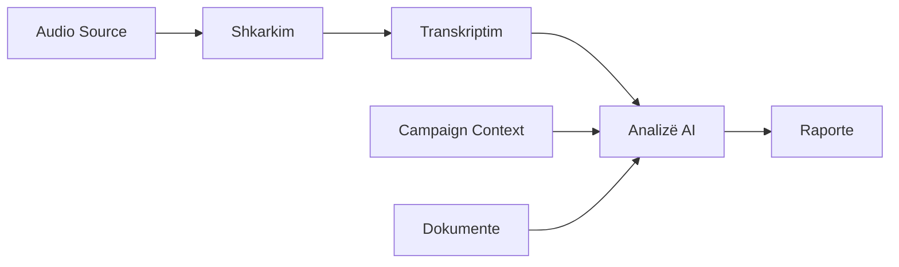

# 📞 Vicidial Call Analysis Platform

**Version:** 2.0
**Author:** Protrade AI
**License:** Proprietary

Një platformë e plotë për analizën automatike të telefonatave nga Vicidial duke përdorur AI (OpenAI GPT-4 dhe Whisper).

---

## 🎯 Çfarë Bën Ky Projekt?

Pipeline i plotë për analizën e telefonatave:
1. 📥 **Shkarkim** - Merr audio nga Vicidial DB, folder lokal ose Google Drive
2. 📝 **Transkriptim** - Konverton audio në tekst me OpenAI Whisper
3. 🤖 **Analizë** - Vlerëson cilësinë e komunikimit me GPT-4
4. 📊 **Raportim** - Gjeneron raporte Excel dhe CSV

### Features Kryesore:
- ✅ **Kontekste Fushatash** - Krijo kontekste të personalizuara për çdo fushatë
- ✅ **Upload Dokumentesh** - Ngarko script, objection handling, oferta (PDF/DOCX)
- ✅ **Multi-Source** - Vicidial, Local, Google Drive
- ✅ **Smart Caching** - Shmang transkriptimin e dyfishuar
- ✅ **Multi-Language** - Raporte në Shqip, Italisht, Anglisht
- ✅ **Smart Reports** - Analiza të avancuara me Cost Analysis
- ✨ **Materiale AI** (NEW) - Gjenero automatikisht objeksione, skripte, FAQ, best practices

---

## 📁 Struktura e Projektit

```
Analyze-calls/
├── app.py                          # 📊 Dashboard kryesor (overview, navigation)
├── pages/                          # 🎨 Streamlit UI pages
│   ├── 1_Pipeline_Komplet.py      #    ⚡ Pipeline i plotë (main workflow)
│   ├── 2_Raporte.py                #    📊 Smart Reports
│   ├── 3_Rezultatet_e_Listave.py  #    📋 List Analysis
│   ├── 4_Tools.py                  #    🛠️ Individual tools (Filtrim, Upload, Transkriptim)
│   └── 5_Settings.py               #    ⚙️ Konfigurime + Campaign Management
├── core/                           # 🧠 Business logic (reusable modules)
│   ├── analysis_llm.py             #    🤖 GPT-4 analysis engine
│   ├── campaign_manager.py         #    🎯 Campaign context & document management
│   ├── config.py                   #    ⚙️ Configuration loader
│   ├── db_vicidial.py              #    💾 Vicidial DB connection
│   ├── downloader_vicidial.py      #    📥 Audio downloader
│   ├── drive_io.py                 #    ☁️ Google Drive integration
│   ├── materials_generator.py      #    ✨ AI materials generator (objections, scripts, FAQ)
│   ├── prefix_it.py                #    🇮🇹 Italian prefix detection
│   ├── reporting_excel.py          #    📊 Excel report generator
│   ├── status_settings.py          #    ⚙️ Status cost settings
│   ├── transcription_audio.py      #    📝 Audio transcription orchestrator
│   ├── transcription_whisper.py    #    🎙️ OpenAI Whisper integration
│   ├── voip_rates.py               #    💰 VoIP rate management
│   └── prompt_analysis_template.txt #   📋 LLM prompt template
├── config/                         # 📋 Configuration files
│   ├── campaign_contexts.json      #    🎯 Campaign definitions
│   ├── settings.json               #    ⚙️ App settings
│   └── voip_rates.json             #    💰 VoIP pricing
├── assets/                         # 📦 Static assets
│   ├── campaigns/                  #    🎯 Campaign documents
│   └── protrade.jpg                #    🖼️ Logo
├── data/                           # 📊 Reference data
│   └── it_prefixes.csv             #    🇮🇹 Italian phone prefixes
├── out_analysis/                   # 📤 Output directory (generated)
└── requirements.txt                # 📦 Python dependencies
```

---

## 🔄 Pipeline Flow



### Hapat e Detajuar:

1. **Input Selection** (`pages/1_Pipeline_Komplet.py`)
   - Zgjidh burimin: Vicidial DB / Local / Drive
   - Zgjidh kampanjën (opsional)
   - Vendos filtra

2. **Audio Download** (`core/downloader_vicidial.py` ose lokal)
   - Shkarkon audio nga burimi i zgjedhur
   - Organizon në strukture: Session/Campaign/Agent/

3. **Transcription** (`core/transcription_audio.py`)
   - Përdor OpenAI Whisper (gpt-4o-transcribe ose whisper-1)
   - Fallback strategy: Direct → WAV → Whisper
   - Caching për të shmangur duplicate

4. **AI Analysis** (`core/analysis_llm.py`)
   - Grupon transkriptet sipas agjentit
   - Merr kontekstin e kampanjës + dokumente
   - GPT-4 analizon dhe jep feedback

5. **Report Generation** (`core/reporting_excel.py`)
   - CSV: call_analysis, agent_summary_weekly
   - Excel: Raport_Analize.xlsx (formatted)

---

## 🚀 Quick Start

### Prerequisites

```bash
# Python 3.9+
python --version

# Virtual environment (optional but recommended)
python -m venv venv
source venv/bin/activate  # Linux/Mac
venv\Scripts\activate     # Windows
```

### Installation

```bash
# 1. Clone repository
git clone <repo-url>
cd Analyze-calls

# 2. Install dependencies
pip install -r requirements.txt

# 3. Configure secrets (Streamlit)
# Create .streamlit/secrets.toml:
mkdir .streamlit
nano .streamlit/secrets.toml
```

**secrets.toml:**
```toml
OPENAI_API_KEY = "sk-..."

[db]
host = "your-vicidial-host"
user = "your-user"
password = "your-password"
database = "asterisk"

[drive]
parent_id = "your-google-drive-folder-id"
```

### Run

```bash
streamlit run app.py
```

Hap shfletuesin te: **http://localhost:8501**

---

## 📚 Usage Examples

### Example 1: Analizë e Shpejtë (Dashboard)

1. Hap **Dashboard** (`app.py`)
2. Kliko **"Pipeline Komplet"**
3. Zgjidh burimin: **"Folder Lokal"**
4. Zgjidh kampanjën: **"Google Reserve UK"**
5. Kliko **"🚀 Nise Pipeline-in e Plotë"**
6. Prit dhe shkarko raportet!

### Example 2: Krijimi i një Kampanje

1. Shko te **Settings** (faqja 5)
2. Tab **"Shto/Ndrysho Fushatë"**
3. Plotëso:
   - Emër: "Tim Business Albania"
   - Project Context: "Thirrje B2B për internet/celular..."
   - Summary Hint: "Vlerëso aftësinë për të krijuar raport..."
   - Bullets Hint: "Preggi: ton profesional..."
4. Ngarko dokumente (max 3): script.pdf, oferta.docx
5. Kliko **"Krijo Fushatën"**

### Example 3: Mjete Individuale

Për hapa të veçantë pa pipeline:

- **Filtrim & Shkarkim** → Shkarko vetëm audio nga Vicidial
- **Drive Upload** → Ngarko file ekzistues në Drive
- **Transkriptim** → Transkripto audio pa analizë
- **Materiale AI** ✨ → Gjenero objeksione, skripte, FAQ, best practices

### Example 4: Gjenerimi i Materialeve AI ✨ (NEW)

1. Shko te **Tools** (faqja 4) → Tab **"🤖 Materiale AI"**
2. Zgjedh llojin: **"🎯 Objeksione & Përgjigje Konsultative"**
3. Zgjedh projektin/fushatën (opsional për kontekst)
4. Zgjedh burimin:
   - **Transkripte ekzistuese**: Vendos path dhe kliko "Gjej transkriptet"
   - **Regjistrime nga DB**: Vendos filtra dhe kliko "Shkarko & Transkripto"
5. Shto instruksione shtesë (opsional): "Fokuso tek objeksionet teknike"
6. Zgjedh gjuhën: Shqip/Italisht/Anglisht
7. Kliko **"🚀 Gjenero Materialin"**
8. Shiko rezultatin dhe eksporto si DOCX/JSON/TXT

**Çfarë gjeneron:**
- **Minimum 10 objeksione** unike me përgjigje konsultative
- Kategorizim (Çmim, Kohë, Konkurrencë, etj.)
- Prevention strategies (si ta parandalosh objeksionin)
- Value building techniques
- Response frameworks
- Example dialogues
- General strategy dhe call flow recommendations

> 📖 Për udhëzime të detajuara, shiko: [`MATERIALE_AI_GUIDE.md`](MATERIALE_AI_GUIDE.md)

---

## 🎯 Core Modules API

### campaign_manager.py

```python
from core.campaign_manager import create_campaign, add_document_to_campaign

# Krijo kampanjë
campaign = create_campaign(
    name="New Campaign",
    project_context_hint="Context here...",
    summary_hint="Summary instructions...",
    bullets_hint="Bullet instructions..."
)

# Shto dokument
add_document_to_campaign(
    campaign_id=campaign["id"],
    file_path=Path("script.pdf"),
    original_filename="Script Shitje.pdf"
)
```

### analysis_llm.py

```python
from core.analysis_llm import analyze_agent_transcripts

# Analizo transkriptet
result = analyze_agent_transcripts(
    agent_name="John Doe",
    transcript_text="Agent: Hello...\nClient: Hi...",
    language="sq",
    project_context_hint="B2B calls...",
    documents_text="Script content..."
)

# Output:
# {
#   "agent": "John Doe",
#   "summary": "Agjenti tregoi...",
#   "preggi": ["Ton profesional", "Qartësi në shpjegim"],
#   "da_migliorare": ["Mbyllje më e fortë"]
# }
```

### materials_generator.py (NEW ✨)

```python
from core.materials_generator import generate_objections_and_responses
from pathlib import Path

# Gjenero objeksione dhe përgjigje konsultative
transcripts = list(Path("out_analysis/session/Transkripte").rglob("*.txt"))

result = generate_objections_and_responses(
    transcript_paths=transcripts,  # TË GJITHA transkriptet
    campaign_context="Shitje B2B për internet biznes",
    documents_text="...",  # Nga kampanja
    additional_instructions="Fokuso tek objeksionet teknike",
    language="sq",
    min_objections=10
)

# Output:
# {
#   "objections": [
#     {
#       "category": "Çmimi",
#       "objection": "Është shumë e shtrenjtë",
#       "frequency": "E lartë",
#       "context": "Kur...",
#       "consultative_approach": {
#         "prevention": "Si ta parandalosh...",
#         "value_building": "Si të ndërtosh vlerë...",
#         "response_framework": "Framework...",
#         "example_dialogue": "Shembull dialogu..."
#       }
#     }
#   ],
#   "general_strategy": "...",
#   "call_flow_recommendations": "...",
#   "total_transcripts_analyzed": 150
# }

# Eksporto
from core.materials_generator import export_to_docx, export_to_json
export_to_docx(result, Path("objections.docx"), "objections")
export_to_json(result, Path("objections.json"))
```

### transcription_audio.py

```python
from core.transcription_audio import transcribe_audio_files

# Transkripto audio
result = transcribe_audio_files(
    input_paths=[Path("call1.mp3"), Path("call2.wav")],
    out_dir=Path("out_analysis"),
    session_name="2025-10-13_Batch1",
    save_txt=True,
    reuse_existing=True
)

# Output:
# {
#   "txt_paths": [Path("...txt"), Path("...txt")],
#   "out_folder": Path("out_analysis/2025-10-13_Batch1")
# }
```

---

## ⚙️ Configuration

### Campaign Contexts (`config/campaign_contexts.json`)

```json
{
  "campaigns": [
    {
      "id": "google_reserve_uk_001",
      "name": "Google Reserve UK - Restorante",
      "project_context_hint": "Thirrje outbound për restorante...",
      "summary_hint": "Fokuso në aftësinë e agjentit...",
      "bullets_hint": "Preggi: edukim digjital...",
      "documents": [
        {
          "filename": "script.pdf",
          "pages": 5,
          "size_kb": 245
        }
      ]
    }
  ]
}
```

### Settings (`config/settings.json`)

```json
{
  "resa_threshold_percent": 5.0,
  "dial_statuses": ["SALE", "CALLBK", "A", "B"],
  "allow_all_statuses": false,
  "status_costs": {
    "SALE": 0.15,
    "CALLBK": 0.05,
    "NI": 0.02
  }
}
```

---

## 🐛 Troubleshooting

### Problem: "OPENAI_API_KEY mungon"

**Zgjidhje:**
```bash
# Kontrollo secrets.toml
cat .streamlit/secrets.toml

# Ose export as environment variable
export OPENAI_API_KEY="sk-..."
```

### Problem: "Nuk lidhet me Vicidial DB"

**Zgjidhje:**
1. Kontrollo VPN connection
2. Verifiko credentials në `secrets.toml`
3. Testo connection: `python test_db.py`

### Problem: "S'gjen ffmpeg"

**Zgjidhje:**
```bash
# Windows (Chocolatey)
choco install ffmpeg

# Mac
brew install ffmpeg

# Linux
sudo apt install ffmpeg
```

### Problem: "File size too large për dokumente"

**Zgjidhje:**
- Max 5MB per file
- Max 3 files per kampanjë
- Max 50 faqe total
- Komprimo PDF ose nda në file më të vegjël

---

## 📊 Dependencies

**Required:**
- `streamlit` - Web UI framework
- `openai` - OpenAI API (Whisper + GPT-4)
- `pymysql` - Vicidial DB connection
- `pandas` - Data manipulation
- `openpyxl` - Excel generation
- `google-api-python-client` - Google Drive integration

**Optional:**
- `PyPDF2` - PDF text extraction
- `python-docx` - Word document extraction
- `librosa` - Audio duration detection
- `ffmpeg` - Audio format conversion

---

## 🔐 Security Notes

⚠️ **Mos e bë commit secrets!**

Files që duhet të jenë në `.gitignore`:
```
.streamlit/secrets.toml
config.py  # Nëse përmban credentials
*.env
venv/
__pycache__/
*.pyc
out_analysis/  # Output files
tmp_*/  # Temporary directories
```

---

## 🤝 Contributing

### Development Setup

```bash
# 1. Fork & clone
git clone <your-fork>

# 2. Create branch
git checkout -b feature/amazing-feature

# 3. Make changes
# ... your code ...

# 4. Test
streamlit run app.py

# 5. Commit
git add .
git commit -m "Add amazing feature"

# 6. Push
git push origin feature/amazing-feature
```

### Code Style

- **Indentation:** 4 spaces
- **Line length:** Max 120 characters
- **Docstrings:** Google style
- **Type hints:** Always use for function signatures
- **Comments:** Explain WHY, not WHAT

---

## 📝 License

Proprietary - All rights reserved © 2025 Protrade AI

---

## 📧 Support

- **Issues:** Open GitHub issue
- **Email:** support@protrade.ai
- **Documentation:** See `/docs` folder

---

## 🎉 Acknowledgments

- OpenAI for Whisper & GPT-4
- Streamlit for amazing web framework
- Vicidial for telephony platform

---

**Made with ❤️ by Protrade AI**


